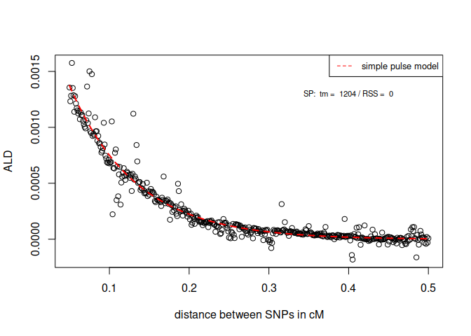
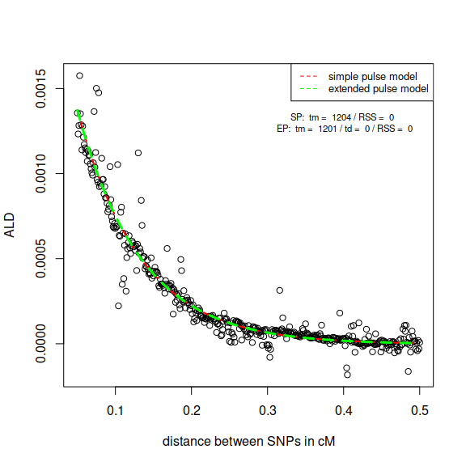
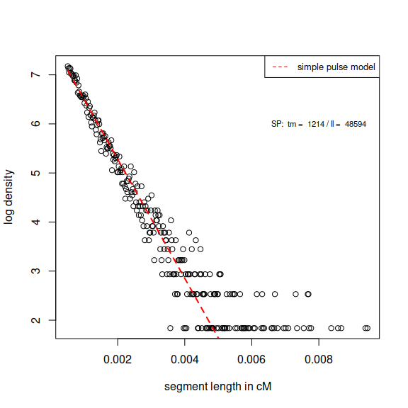
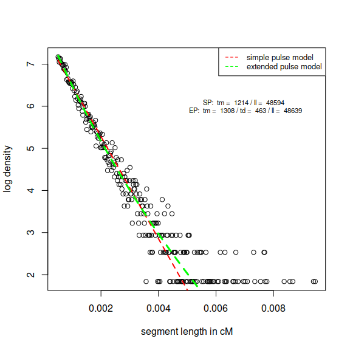

Fitting the simple and extended pulse models
================
Leonardo N. M Iasi
2021-06-21

The descriptions of the models can be found here
(<https://www.biorxiv.org/content/10.1101/2021.04.04.438357v2>). In
brief, one approach to learn about admixture dates from genetic data
uses a recombination clock model: Conceptually, admixture segments are
the result of the introduced chromosomes being broken down by
recombination; the offspring of an archaic and a modern human parent
will have one whole chromosome each of either ancestry. Thus, the
offsprings’ markers are in full ancestry linkage disequilibrium (ALD);
all archaic variants are present on one DNA molecule, and all modern
human one on the other one. In each generation meiotic recombination
will reshuffle the chromosomes, progressively breaking down the
ancestral chromosome down into shorter segments of archaic ancestry and
the Admixture induced Linkage Disequilibrium (ALD) similarly decreases
with each generation after gene flow. One can fit the decline of segment
length or ALD to resolve for the time since the admixture event. The
simple pulse model assumes that all admixture happens in one generation
and uses an exponential distribution to fit the segment length (using
the exponential PDF) or ALD (using the tail function of the exponential)
to resolve for the mean time of gene flow (tm).

The extended pulse relaxes the one generation assumption by modeling the
admixture process over a certain duration (td) as a discretized gamma
distribution with shape = k+1 and scale = tm/k, rescaled by the
admixture proportion alpha. Where, td= 4 tm k^(-1/2).

This results in a heavier tailed length distribution of segments/ALD
(Lomax pdf/Lomax tail function).

The admixture estimates both for ALD or directly inferred segments rely
on precise genetic distances. We do not recommend to use a constant
recombination rate to convert physical distances into genetic distances,
rather population specific recombination maps.

# Fitting using ALD

To fit the simple and extended pulse on ALD we use the raw output from
the ALDER program (Loh et al. 2013) can be used. The data has 3 columns:
col 1 = distance between bins of SNPs the LD is computed for in
centiMorgan, col 2 = the LD per bin, col 3 (optional) = bin count. The
script
[Fitting\_simple\_and\_extended\_pulse\_to\_ALD.R](Extended_Admixture_Pulse_inferrence/Fitting_simple_and_extended_pulse_to_ALD.R)
is based on Moorjani et al. 2016. It uses an residual sum of squares
optimization function (DEoptim) to get good starting parameters for the
nls function. Three parameters must be provided lval = lower value of
distance between SNPs, hval = maximum value of distance and affine =
(logical) if a parameter modeling background LD should be used. The
lower and upper boundaries for the optimization are currently hard coded
and are reasonable boundaries for Neandertal introgression, but one
might want to change them for other scenarios.

## Example

In this documentation we will discuss two ways of modeling the Ancestry
Linkage Disequilibrium between introgressed SNPs after a certain time t.
The simple pulse model assumes that all the introgressed material
entered in just one generation (i.e. the duration of gene flow was one
generation) a time \(t_m\) ago. The extended pulse relaxes this
assumption. here, the introgressed material can enter over an extended
period of time with a mean time of that period being \(t_m\). The
duration (\(t_d\)) is defined by the parameter k, whereas
\[t_d = 4 t_m k^{(-\frac{1}{2})}\].

We will follow an example of an extended period of gene flow between
Neandertal and Non-Africans around 50,000 years ago. We use simulated
data generated using msprime coalescent simulations. The simulation used
an empirical map to simulate realistic recombination patterns. In this
simulation \(t_m = 1,500\) generations ago and \(t_d = 2000\)
generations. We obtained the SNPs from Africans Non-Africans and
Neandertals from our simulation. To enrich for introgressed sites we
ascertained the data. Here, all Africans must have the ancestral allele
and Neandertals must be polymorphic for the derived one. We used the
ALDER program to calculate the weighted LD in the admixed population
(Non-Africans) given the two reference populations (Africans and
Neandertals).

### Fitting the simple pulse to ALD data

First, we want to fit the simple pulse model, which assumes implicitly a
duration \(t_d = 1\). The simple pulse will give us the estimate for the
mean time of admixture \(t_m\).

#### Parameters

This are the parameters used for the function which fitts the simple
pulse model.

##### The path to the segment file

We use the raw ALDER output file for the fitting. The file contains of 3
columns. Distance, weighted LD and

``` r
suppressPackageStartupMessages({
  library(VGAM)
  library(tidyverse)
  library("DEoptim")
  library("MASS")
  library(bbmle)
  library(rethinking)
  library(DPQ)
  library(viridis)
})

input <- "Example_ALD.txt"
```

##### upper and lower thresholds for truncation

For ALD data we must provide length thresholds, since LD for a distant 0
between to SNPs is not defined. To give an upper and lower distance we
use the parameters lower\_trunc and upper\_trunc. Numeric parameter to
define lower (lower\_trunc) and upper (upper\_trunc) cutoff for the
segment length given in cM.

``` r
lower_trunc <- 0.05 
upper_trunc <- 0.5
```

##### Using a constant to model background LD

This is a logical parameter (True/False) if a constant should be used to
model background LD when fitting ALD data. We recommend to do it.

``` r
constant <- T   
```

##### tm upper and lower boundries

To limit the search space, especially for the extended pulse model fit
you must give an upper and lower boundary for the \(t_m\) parameter. In
our example we know from Archaeological records that no Neandertal
remains were found to be younger than 35,000 years so we can set a very
loose lower boundary at 100 generations ago (3000 years ago) and an
upper boundary 5000 generations ago, which is a roughly double the
estimated split time between Africans and Non-Africans. You need to
adjust these boundaries to your model organism. At least give a lower
boundary at 1 generation and a finite value for the upper since the time
of gene flow can not be negative.

``` r
tm_lower <-  100
tm_upper <-  5000
```

#### Running the function

Now we define all our parameters. First we need to read in the ALD data
using the *Get\_points* function. After that we can execute
*Simple\_Pulse\_ALD\_fn*.

``` r

ALD_data <- Get_points(input = input,lower_trunc = lower_trunc, upper_trunc = upper_trunc)

SP_Fit_ALD <- Simple_Pulse_ALD_fn(Data = ALD_data,constant = constant,
                           tm_lower = tm_lower,tm_upper = tm_upper)
```

Let’s have a look ate the output. The function returns a list with four
objects. 1st The list object from the nls function, 2nd a data frame
with the estimate of the best fitting \(t_m\), the
residual-sum-of-squares (RSS) and lower and upper truncations on the ALD
data used. The 3rd object is the data used i.e. the truncated ALD used
for fitting. The last object is the models prediction of the ALD for
SNPs a certain genetic distance in Morgans apart.

For compatibility intervals we can use the *Get\_CI\_fn*.

``` r
tm_CI_SP <- Get_CI_fn(est = SP_Fit_ALD[[2]]$tm,n_data = SP_Fit_ALD[[3]]$dist)
```

The estimate for \(t_m\) using the simple pulse model is 1204.417776,
1093.2586926, 1315.5768594 with a RSS is 2.876584310^{-6}.

##### Visualize the fit to the data

We can visualize the data using the objects from the simple pulse
function. We are going to plot the ALD as a function of genetic distance
between SNPs in centiMorgan. We can get the (truncated) input ALD data
from the list object the simple pulse function returns. We can plot our
prediction using object four returned by the simple pulse function.

``` r
input_ALD_cM = SP_Fit_ALD[[3]]

plot(x=input_ALD_cM$dist,y=input_ALD_cM$LD,ylab = "ALD", xlab = "distance between SNPs in cM")
lines(SP_Fit_ALD[[4]]$dist_M*100,SP_Fit_ALD[[4]]$ALD,col="red",lty=2,lwd=2)
legend("topright", legend=c("simple pulse model"),
       col=c("red"), lty=2, cex=0.8)
text(x = 0.4, y = 0.0013 , labels = paste("SP: ","tm = ",round(SP_Fit_ALD[[2]]$tm,0),"/","RSS = ",round(SP_Fit_ALD[[2]]$RSS,5)),cex = 0.7)
```

<!-- -->

### Fitting the extended to segment length data

We use the same setup and data as before but now we want to fit the
extended pulse which has one additional parameter \(k\). This parameter
is related to the duration of admixture such that
\[t_d = 4 t_m k^{(-\frac{1}{2})}\].

#### Parameters

The *Extended\_Pulse\_ALD\_fn* function takes the same parameter with
two additional ones setting the boundaries for k.

##### k upper and lower boundries

This is only needed for the extended pulse model. The parameter k is
defined for a parameter space between 2 (continuous gene flow) and
infinity (pulse gene flow). Realistically the parameter will not go to
infinity and will fit in a one generation pulse with a high number at
least bigger than 100. here we choose 1e8. Our lower value is 2, since k
is not defined for a value smaller than 2.

``` r
k_lower <- 2
k_upper <- 1e8
```

#### Running the function

``` r

EP_Fit_ALD <- Extended_Pulse_ALD_fn(Data = ALD_data,constant = constant,
                           tm_lower = tm_lower,tm_upper = tm_upper,
                           k_lower = k_lower,k_upper = k_upper)
#> Warning in nls(wcorr ~ c + A * (1/(1 + ((tm/(1/k)) * (dist/100))))^((1/k)), :
#> Convergence failure: false convergence (8)

tm_CI_EP <- Get_CI_fn(est = EP_Fit_ALD[[2]]$tm,n_data = EP_Fit_ALD[[3]]$dist)
k_CI_EP <- Get_CI_fn(est = EP_Fit_ALD[[2]]$k,n_data = EP_Fit_ALD[[3]]$dist)
```

The nls function sometimes gives a warning message. Especially for the
extended pulse model we recommend to run the function iteratively and
choose the best fitting model with the smallest RSS. The
*Extended\_Pulse\_ALD\_fn* function returns the same list as the
*Simple\_Pulse\_ALD\_fn* function, with four objects. The difference now
is that we estimated one parameter more \(k\), which is included in the
data frame (object two) with the estimate of \(t_m\) and \(k\) and the
corresponding RSS. The estimate for \(t_m\) using the extended pulse
model is 1202.2684072, 1091.307695, 1313.2291193 with a RSS of
2.876615110^{-6}. The estimate for \(k\) is 10^{8}, 9.07707210^{7},
1.092292810^{8}. This number is not straightforward to interpret, but we
can plug it in in our definition of the gene flow duration
\[t_d = 4 t_m k^-(1/2)\], 0.1202268

### Visualize the fit to the data

We can visualize the data the same way as we did for the simple pulse
and plot everything together.

``` r
plot(x=input_ALD_cM$dist,y=input_ALD_cM$LD,ylab = "ALD", xlab = "distance between SNPs in cM")
lines(SP_Fit_ALD[[4]]$dist_M*100,SP_Fit_ALD[[4]]$ALD,col="red",lty=2,lwd=2)
lines(EP_Fit_ALD[[4]]$dist_M*100,EP_Fit_ALD[[4]]$ALD,col="green",lty=2,lwd=3)
legend("topright", legend=c("simple pulse model","extended pulse model"),
       col=c("red","green"), lty=2, cex=0.8)
text(x = 0.4, y = 0.0013 , labels = paste("SP: ","tm = ",round(SP_Fit_ALD[[2]]$tm,0),"/","RSS = ",round(SP_Fit_ALD[[2]]$RSS,5),"\n","EP: ","tm = ",round(EP_Fit_ALD[[2]]$tm,0),"/","td = ",round(EP_Fit_ALD[[2]]$tm*EP_Fit_ALD[[2]]$k^(-1/2),0),"/","RSS = ",round(EP_Fit_ALD[[2]]$RSS,5)),cex = 0.7)
```

<!-- -->

# Fitting using segment length

To fit the simple and extended pulse using segment data one can infer
segments using many approaches. In our paper we used the method of Skov
et al 2018. We only consider high probability segments with a posterior
probability of 0.9 or higher and not shorter or longer than 0.05.1.2 cM.
Be sure to only consider unique segments. If a segments is inferred to
have the same physical starting and ending position (on the same
chromosome) across individuals only count it once. Otherwise the
independence assumption of observed segment length is violated. The
script
[Fitting\_simple\_and\_extended\_pulse\_to\_segment\_length.R](Extended_Admixture_Pulse_inferrence/Fitting_simple_and_extended_pulse_to_segment_length.R)
to fit the simple/extended pulses to directly inferred segments. We uses
the R optim function (method=“L-BFGS-B”) to fit the data to an
exponential or lomax pdf. The input data must at least contain one
column (length\_cM) giving the length of unique segments in centiMorgan.
There are two additional parameters lower and upper cutoffs which
indicates the bounds in which segments can be reliably be called. If you
use cutoff, a truncated version of the pdf’s will be fitted.

## Example

We use the same example as before but now with segment data. The
simulated segments are given in the *Example\_seg.txt* file.

### Fitting the simple to segment length data

First, we want to fit the simple pulse model, which assumes implicitly a
duration \(t_d = 1\). The simple pulse will give us the estimate for the
mean time of admixture \(t_m\).

#### Parameters

This are the parameters used for the function which fits the simple
pulse model.

##### The path to the segment file

The segment file is read in using the \[input\] parameter (file\_path).
The file must at least contain one column giving the length of each
unique segment in cM. The column must be named \[length\_cM\].

``` r
suppressPackageStartupMessages({
  library(VGAM)
  library(tidyverse)
  library("DEoptim")
  library("MASS")
  library(bbmle)
  library(rethinking)
  library(DPQ)
  library(viridis)
})

input <- "Example_seg.txt"
```

##### truncation

Somtimes it is necessery to truncate the segment length distribution,
especially if the segments are inferred you might want to exclude
extremely short segments (e.g. smaller than 0.05 cM) since they are
usually inferred with low confidence. You might also exclude very long
segments which might be wrongly inferred by some approaches where two
segments close by are accedently joined to one long segment. The upper
length cutoff is highly dependent on your scenario you are interested
in. For Neandertal gene flow we do not expect segments to be longer then
1 cM.

Parameter (truncation = TRUE/FALSE) to define if you want to exclude
segments given a certain threshold length in cM from the fitting
(defined by upper and lower trunc parameters)

``` r
truncation <-  T
```

##### upper and lower thresholds

Only used if truncation = T. Numeric parameter to define lower
(lower\_trunc) and upper (upper\_trunc) cutoff for the segment length
given in cM

``` r
lower_trunc <- 0.05 
upper_trunc <- 1
```

##### tm upper and lower boundries

To limit the searchspace, especially for the extended pulse model fit
you must give an upper and lower boundary for the \(t_m\) parameter. In
our example we know from Archaeological records that no Neandertal
remains were found to be younger than 35,000 years so we can set a very
loose lower boundary at 100 generations ago (3000 years ago) and an
upper boundary 5000 generations ago, which is a roughly double the
estimated split time between Africans and Non-Africans. You need to
adjust these boundaries to your model organism. At least give a lower
boundary at 1 generation and a finite value for the upper since the time
of gene flow can not be negative.

``` r
tm_lower <-  100
tm_upper <-  5000
```

#### Running the function

Now we define all our parameters. All we need to doo now is executing
the *Simple\_Pulse\_Segments\_fn* function.

``` r

SP_Fit_Seg <- Simple_Pulse_Segments_fn(input = input,truncation = truncation,
                           lower_trunc =lower_trunc,upper_trunc = upper_trunc,
                           tm_lower = tm_lower,tm_upper = tm_upper)
```

Let’s have a look ate the output. The *Simple\_Pulse\_Segments\_fn*
returns a list with four objects. 1st The list object from the optim
function, 2nd a data frame with the estimate of maximum likelihood
estimate of \(t_m\), the log likelihood and lower and upper truncations
on the segments used. The 3rd object is the data used i.e. the truncated
segments used for fitting. The last object is the models prediction of
the log density for segments length in Morgen.

For compatibility intervals we can use the *Get\_CI\_fn*.

``` r
tm_CI_SP <- Get_CI_fn(est = SP_Fit_Seg[[2]]$tm,n_data = SP_Fit_Seg[[3]])
```

The MLE for \(t_m\) using the simple pulse model is 1213.8525853,
1187.1928156, 1240.512355 with a log likelihood of 4.85937610^{4}.

##### Visualize the fit to the data

We can visualize the data using the objects from the
*Simple\_Pulse\_Segments\_fn*. We are going to plot the log density of
segment length in cM. We can get the (truncated) input segments from the
list object the simple pulse function returns. We can transform the data
from Morgan to centiMorgan (which is the more common measure used). To
get a nice density plot we can use the hist function with parameter plot
= F, with 500 breaks and save it to the plot\_data object.

``` r
input_segments_M = SP_Fit_Seg[[3]]
input_segments_cM = input_segments_M/100
plot_data <- hist(input_segments_cM,breaks = 500,plot = F)
```

Now we can plot the input log density of the input segments. We can plot
our prediction using object four returned by the simple pulse function.

``` r
plot(x=plot_data$mids,y=log(plot_data$density),ylab = "log density", xlab = "segment length in cM")
lines(SP_Fit_Seg[[4]]$seg_len_M/100,SP_Fit_Seg[[4]]$log_dens,col="red",lty=2,lwd=2)
legend("topright", legend=c("simple pulse model"),
       col=c("red"), lty=2, cex=0.8)
text(x = 0.008, y = 6 , labels = paste("SP: ","tm = ",round(SP_Fit_Seg[[2]]$tm,0),"/","ll = ",round(SP_Fit_Seg[[2]]$ll_sp,0)),cex = 0.7)
```

<!-- -->

### Fitting the extended to segment length data

We use the same setup and data as before but now we want to fit the
extended pulse which has one additional parameter \(k\). This parameter
is related to the duration of admixture such that
\(t_d = 4 t_m k^-(1/2)\).

#### Parameters

The *Extended\_Pulse\_Segments\_fn* takes the same parameter with two
additional ones setting the boundaries for k.

##### k upper and lower boundries

This is only needed for the extended pulse model. The parameter k is
defined for a parameter space between 2 (continuous gene flow) and
infinity (pulse gene flow). Realistically the parameter will not go to
infinity and will fit in a one generation pulse with a high number at
least bigger than 100. here we choose 1e8. Our lower value is 2, since k
is not defined for a value smaller than 2.

``` r
k_lower <- 2
k_upper <- 1e8
```

#### Running the function

``` r
EP_Fit_Seg <- Extended_Pulse_Segments_fn(input=input ,truncation = truncation,
                             lower_trunc = lower_trunc,upper_trunc = upper_trunc,
                             tm_lower = tm_lower,tm_upper = tm_upper,
                             k_lower = k_lower,k_upper = k_upper)

tm_CI_EP <- Get_CI_fn(est = EP_Fit_Seg[[2]]$tm,n_data = EP_Fit_Seg[[3]])
k_CI_EP <- Get_CI_fn(est = EP_Fit_Seg[[2]]$k,n_data = EP_Fit_Seg[[3]])
```

The *Extended\_Pulse\_Segments\_fn* returns the same list as the
*Simple\_Pulse\_Segments\_fn*, with four objects. The difference now is
that we estimated one parameter more \(k\), which is included in the
data frame (object two) with the estimate of maximum likelihood estimate
of \(t_m\) and \(k\) and the corresponding log likelihood. The MLE for
\(t_m\) using the extended pulse model is 1307.9921821, 1279.2648303,
1336.719534 with a log likelihood of 4.863936910^{4}. The MLE for \(k\)
is 7.9692029, 7.7941758, 8.14423. This number is not straight forward to
interpret, but we can plug it in in our definition of the gene flow
duration \(t_d = 4 t_m k^-(1/2)\), 463.3377726

### Visualize the fit to the data

We can visualize the data the same way as we did for the simple pulse.

``` r
input_segments_M = EP_Fit_Seg[[3]]
input_segments_cM = input_segments_M/100
plot_data <- hist(input_segments_cM,breaks = 500,plot = F)
```

Now we can plot the input log density of the input segments. We can plot
our prediction using object four returned by the simple pulse function.

``` r
plot(x=plot_data$mids,y=log(plot_data$density),ylab = "log density", xlab = "segment length in cM")
lines(SP_Fit_Seg[[4]]$seg_len_M/100,SP_Fit_Seg[[4]]$log_dens,col="red",lty=2,lwd=2)
lines(EP_Fit_Seg[[4]]$seg_len_M/100,EP_Fit_Seg[[4]]$log_dens,col="green",lty=2,lwd=3)
legend("topright", legend=c("simple pulse model","extended pulse model"),
       col=c("red","green"), lty=2, cex=0.8)
text(x = 0.007, y = 6 , labels = paste("SP: ","tm = ",round(SP_Fit_Seg[[2]]$tm,0),"/","ll = ",round(SP_Fit_Seg[[2]]$ll_sp,0),"\n","EP: ","tm = ",round(EP_Fit_Seg[[2]]$tm,0),"/","td = ",round(EP_Fit_Seg[[2]]$tm*EP_Fit_Seg[[2]]$k^(-1/2),0),"/","ll = ",round(EP_Fit_Seg[[2]]$ll_ep,0)),cex = 0.7)
```

<!-- -->
